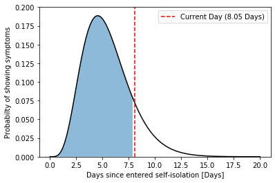

# Covid19_Incubation_tracker

This python code is for individuals that are entering the 14 day self-isolation after possible exposure to prevent the spread of Covid 19. This scipt plots the gamma distribution given from Lauer SA, Grantz KH, Bi Q, et al [1] and determines your progress through the incubation time.  

[1] Lauer SA, Grantz KH, Bi Q, et al. The Incubation Period of Coronavirus Disease 2019 (COVID-19) From Publicly Reported Confirmed Cases: Estimation and Application. Ann Intern Med. 2020; [Epub ahead of print 10 March 2020]. doi: https://doi.org/10.7326/M20-0504
